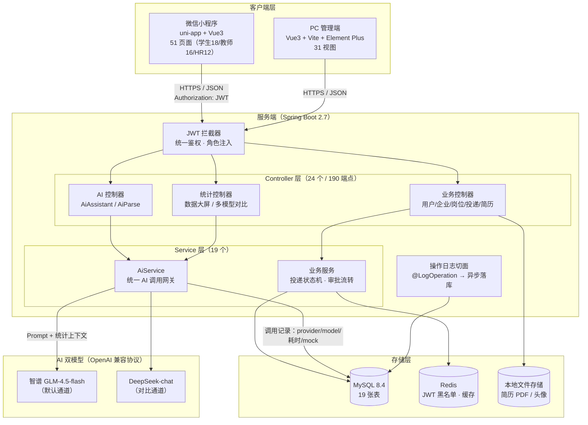
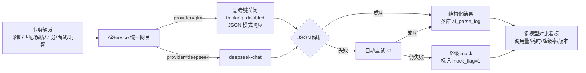

# 论文素材一：系统架构图

> Mermaid 源码，可直接在支持 Mermaid 的工具（Typora/VS Code/GitHub/mermaid.live）渲染后截图插入论文。

## 1. 系统总体架构图

## 2. AI 双模型调用链路图（论文实验部分用）

## 3. 文字说明素材（论文可直接改写）

本系统采用前后端分离架构。客户端层由微信小程序（覆盖学生、教师、企业 HR 三类移动端场景，51 个页面）与 PC 管理端（面向管理员与数据运营，31 个视图）组成，均通过 RESTful API 与服务端通信，身份凭证采用 JWT 无状态令牌，敏感字段（手机号等）采用 AES 加密存储。

服务端基于 Spring Boot 2.7，共 24 个控制器、190 个 REST 端点。核心业务逻辑包括投递状态机（状态单向推进、终态锁定，由后端强制校验）与审批流转。AI 能力由统一的 AiService 网关封装，支持智谱 GLM 与 DeepSeek 双模型通道，输出强制 JSON 模式并具备解析失败自动重试与降级标记机制；每次调用的提供方、模型版本、耗时与降级情况均持久化至 ai_parse_log 表，构成多模型对比实验的数据来源。
